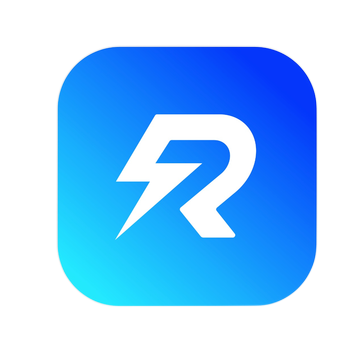
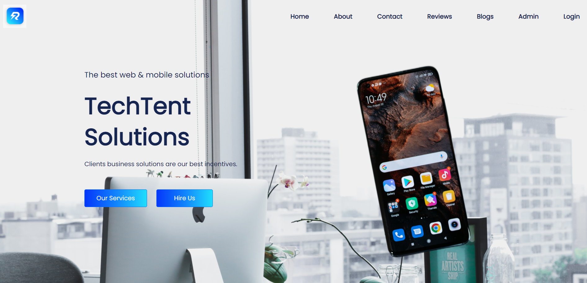

<!-- PROJECT LOGO -->
<br />
<p align="center">
  <a href="https://github.com/github_username/repo_name">
    
  </a>

  <h3 align="center">TechTent Solutions</h3>

  <p align="center">
    A Software Company With Different Services For Clients
    <br />
    <a href="https://github.com/github_username/repo_name"><strong>Explore the docs »</strong></a>
    <br />
    <br />
    <a href="https://github.com/github_username/repo_name">View Demo</a>
  </p>
</p>


<!-- ABOUT THE PROJECT -->
## About The Project

<a href="https://github.com/github_username/repo_name">
    
 </a>

This ia a software company website with many features and fully interactive.
The key features are :
1. Separate client site and admin panel
2. Email verification
3. Interactive
4. Fully Secured


### FrontEnd Built With

* [React.JS](https://reactjs.org/)
* [Bootstrap 5](https://getbootstrap.com/)
* [Material UI](https://material-ui.com/)
* [AOS Library](https://michalsnik.github.io/aos/)
* [Email.JS](https://www.emailjs.com/)
* [React Hooks](https://reactjs.org/docs/hooks-intro.html)
* [React Router DOM](https://reactrouter.com/web/guides/quick-start)
* [React Hook Form](https://react-hook-form.com/)
* [Firebase](https://firebase.google.com/)
* [Google Map](https://cloud.google.com/maps-platform)
* [Recharts](https://recharts.org/en-US/)
* [React FontAwesome](https://fontawesome.com/v5.15/how-to-use/on-the-web/using-with/react)
* [Stripe](https://stripe.com/en-gb-us)

### BackEnd Built With
* [Node.JS](https://nodejs.org/en/)
* [Express.JS](https://expressjs.com/)
* [Nodemon](https://nodemon.io/)
* [Cors](http://expressjs.com/en/resources/middleware/cors.html)
* [Nodemailer](https://nodemailer.com/about/)
* [MongoDB](https://www.mongodb.com/)
* [Dotenv](https://www.npmjs.com/package/dotenv)


<!-- GETTING STARTED -->
## Getting Started


### Installation

1. Create a Reactjs project
   ```sh
   npx create-react-app my-project
   ```

After that the other libraries and dependencies were installed


<!-- USAGE EXAMPLES -->
## Usage
 
_Client can go through this website very easily_
<br />
_The services section shows the useful services provided by the company and clients can purchase any service they need_
<br />
_The website is well secured for clients and admins so there would be no security issues_


<!-- CONTACT -->
## Contact

LinkedIn - [Shafayat Tazoar](https://www.linkedin.com/in/afitazoar/)
Facebook - [Shafayat Tazoar](https://m.me/shafayat.tazoar.27) 
Email - [shafayattazoar27.official@gmail.com](shafayattazoar27.official@gmail.com) 

Project Link: [will be updated soon](https://github.com/github_username/repo_name)


